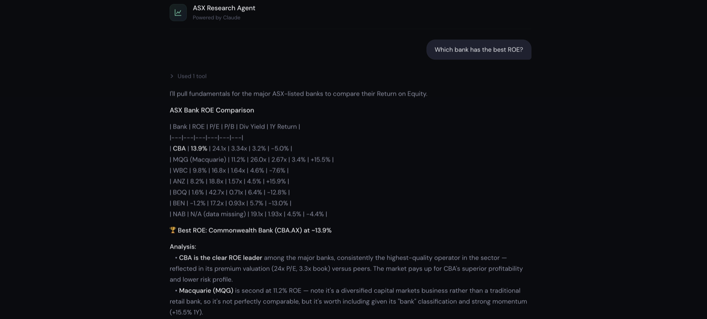
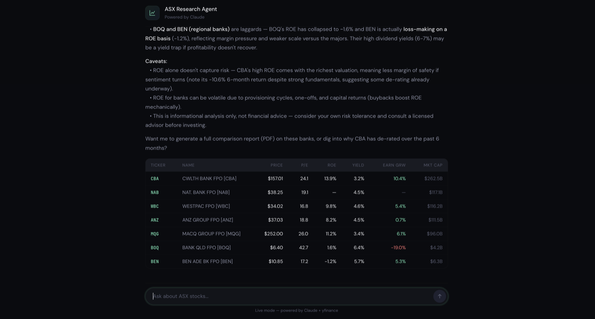

# ASX Investment Research & Trading Agent

An agentic AI system powered by **Claude** that researches, analyses, and reports on ASX equities using natural language.



Ask a question in plain English and the agent decides which tools it needs, pulls live market data, and writes the analysis — including the caveats.



Note `NAB — data missing`: when a field isn't available from the data source the agent says so and explains where to find it, rather than inventing a number.

## How It Works

You ask questions in plain English. Claude reasons about what data it needs, calls the right tools, and synthesises findings into clear analysis or a PDF report.

```
You: "Find undervalued mining stocks with strong dividends and compare them"

Agent:
  🔧 Calling tool: screen_stocks({"sectors": ["Basic Materials"], "max_pe_ratio": 15, "min_dividend_yield": 0.04})
  🔧 Calling tool: compare_stocks({"tickers": ["BHP.AX", "RIO.AX", "FMG.AX"]})

  Based on screening the ASX mining sector for low P/E and high dividends,
  here are the top candidates...
```

## Architecture

```
User Query (natural language)
    │
    ▼
┌─────────────────────────────┐
│   Claude (LLM Brain)        │
│   - Understands intent      │
│   - Plans tool calls        │
│   - Synthesises analysis    │
└─────────┬───────────────────┘
          │ tool_use
          ▼
┌─────────────────────────────┐
│   Tools                     │
│   ├── get_stock_data        │  ← yfinance fundamentals
│   ├── get_stock_news        │  ← recent headlines
│   ├── screen_stocks         │  ← filter by criteria
│   ├── compare_stocks        │  ← side-by-side comparison
│   ├── generate_report       │  ← PDF report generation
│   ├── create_chart          │  ← SVG charts from computed data
│   └── create_diagram        │  ← SVG flows and relationships
└─────────┬───────────────────┘
          │ tool_result
          ▼
┌─────────────────────────────┐
│   Claude (analysis)         │
│   - Interprets results      │
│   - May call more tools     │
│   - Returns final answer    │
└─────────────────────────────┘
```

## Quick Start (web UI)

**Double-click `start.command`** in Finder.

It creates the virtual environment if missing, installs anything absent,
starts the server, and opens http://localhost:5001 in your browser.
Leave that window open while you use the agent — closing it (or Ctrl-C)
stops the server.

Equivalent from a terminal:

```bash
./start.command
```

Opening `asx_agent_ui.html` directly from Finder also works, but **only while
the server is running** — the page has no API key and no market data of its
own, it just talks to `server.py`.

## No-Terminal Start

Two pieces, installed and running:

**Always on** — `~/Library/LaunchAgents/com.qfinance.asxagent.plist` starts
`server.py` at login and restarts it if it dies, so http://localhost:5001 is
always live. Output goes to `agent.log`.

```bash
launchctl kickstart -k gui/$UID/com.qfinance.asxagent   # restart (after a code change)
launchctl bootout gui/$UID/com.qfinance.asxagent        # stop until next login
launchctl bootstrap gui/$UID ~/Library/LaunchAgents/com.qfinance.asxagent.plist   # start again
```

Note: the server does **not** auto-reload, so restart it after editing
`server.py`, `tools.py`, or `config.py`.

**`ASX Agent.app`** — double-click it (or keep it in the Dock) to open the UI.
No Terminal window; it starts the server first if it isn't up, and shows a
dialog instead of a stack trace if something is wrong.

## Setup (manual)

```bash
python3 -m venv .venv
.venv/bin/python -m pip install -r requirements.txt
```

Put your key in a `.env` file in this directory (already gitignored):

```
ANTHROPIC_API_KEY=sk-ant-...
```

## Usage

### Web UI
```bash
.venv/bin/python server.py   # then open http://localhost:5001
```

### Interactive Mode
```bash
.venv/bin/python agent.py              # live data from yfinance
.venv/bin/python agent.py --demo       # sample data (no network needed)
```

### One-Shot Queries
```bash
.venv/bin/python agent.py "Compare BHP and RIO on valuation and dividends"
.venv/bin/python agent.py "Which ASX bank has the best ROE?"
.venv/bin/python agent.py "Generate a report on the top 5 growth stocks"
python agent.py --demo "Find stocks with dividend yield above 5%"
```

## Example Queries

| Query | What the agent does |
|-------|-------------------|
| "Find undervalued mining stocks" | Screens by sector + low P/E, fetches data, analyses |
| "Compare CBA, NAB, WBC, ANZ" | Fetches all 4, builds comparison, highlights differences |
| "Which stock has the best growth?" | Screens universe, ranks by revenue/earnings growth |
| "Generate a dividend-focused report" | Screens for yield, fetches data + news, builds PDF |
| "Tell me about CSL" | Fetches fundamentals + news, gives a quick profile |
| "Graph BHP, RIO and FMG dividend yields" | Fetches the yields, creates a bar chart, and explains the pattern |
| "Diagram how the stock screening process works" | Creates and displays a flow diagram |

## Project Structure

| File | Purpose |
|------|---------|
| `agent.py` | **Main entry point** — agentic loop with Claude |
| `tools.py` | Tool schemas (what Claude sees) + implementations |
| `visualizations.py` | Safe SVG chart and diagram generation |
| `report.py` | PDF report generation via reportlab |
| `sample_data.py` | Demo data for offline testing |
| `config.py` | Legacy config (used by report.py) |
| `ingest.py` | Standalone data ingestion (non-agent mode) |
| `analyse.py` | Standalone filtering (non-agent mode) |
| `compare.py` | Standalone ranking (non-agent mode) |
| `main.py` | Legacy pipeline runner (non-agent mode) |

## Requirements

- Python 3.10+
- Anthropic API key (`ANTHROPIC_API_KEY` env var)
- Internet access for yfinance (or use `--demo` mode)
